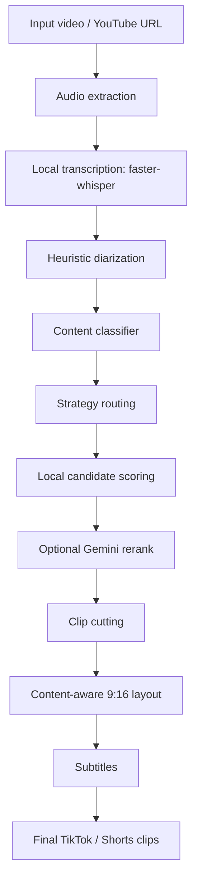

# AI Virtual Cutter

AI Virtual Cutter is a local-first system for turning long-form videos into vertical short-form clips for TikTok, YouTube Shorts, and Instagram Reels. It supports multiple content types, including gameplay, podcasts, tutorials and screencasts, commentary and news, and a generic fallback mode.

## Why This Project Matters

Short-form editing is usually manual, expensive, or tightly coupled to paid APIs. This project explores a more practical alternative:

- keep the core pipeline local-first
- reduce dependency on paid cloud services
- adapt framing to the content instead of doing a naive 16:9 to 9:16 crop
- evaluate changes against a real benchmark corpus instead of intuition alone

## Key Features

- Local-first pipeline for clip discovery, cutting, subtitles, and rendering
- Faster-Whisper transcription with reusable local transcript artifacts
- Heuristic speaker diarization with conservative merging for low-risk speaker attribution
- Content classification for `gameplay`, `podcast`, `tutorial`, `commentary`, and `generic`
- Strategy routing with different scoring preferences per content type
- Content-aware 9:16 layout system
- Automatic subtitle rendering
- Optional Gemini rerank and fallback flow
- Benchmark suite with 6 real cases
- Human review workflow with preserve/archive merge behavior
- Defensive fallback handling across transcription, diarization, layout, and rendering

## Architecture



## Pipeline Overview

1. Transcribe the source video locally.
2. Apply heuristic diarization to estimate speaker turns.
3. Classify the material type.
4. Route selection and render decisions through a content-aware strategy.
5. Score candidate clip windows locally.
6. Optionally rerank the final pool with Gemini.
7. Cut clips and render them as vertical 9:16 outputs.
8. Burn subtitles and export short-form-ready files.

## 9:16 Layout System

The final output is always vertical 9:16.

- `gameplay` uses `gameplay_priority_crop`
  The crop stays stable, avoids overreacting to tiny facecams near screen edges, and prefers preserving the main gameplay action.
- `tutorial` uses `full_frame_blur_background`
  The full 16:9 screen remains visible inside a vertical canvas with a blurred background, which keeps screencasts readable.
- `podcast` uses `speaker_face_crop`
  Face tracking remains useful here and is weighted much more heavily than in gameplay.
- `commentary` uses `stable_subject_crop`
  The framing is calmer and avoids distracting jumps.
- `generic` uses `safe_center_crop`
  This is the safe fallback when the material is ambiguous.

## Repository Structure

```text
analyze_virals.py        Candidate generation, scoring, and optional rerank
benchmark.py             Benchmark runner and reporting
cutter.py                Clip cutting and content-aware 9:16 rendering
manager.py               End-to-end CLI orchestration
layout/                  Layout profiles for final vertical rendering
strategies/              Selection strategies per content type
transcription/           Transcription backends
diarization/             Diarization backends
tests/                   Unit tests
benchmarks/              Benchmark config, latest report, latest results, review template
```

## Getting Started

### Requirements

- Python 3.11+
- FFmpeg and FFprobe available in `PATH`
- Optional: GPU support for faster transcription
- Optional: Gemini API key for rerank or subtitle checking features

### Install

```bash
git clone <repo-url>
cd AI-virtual-cutter
python -m venv .venv
.venv\Scripts\activate
pip install -r requirements.txt
```

### Run the full pipeline

```bash
python manager.py --url "https://www.youtube.com/watch?v=..."
```

### Run fully local selection and rendering

```bash
python manager.py --content-type auto --ai-mode local_only --subtitle-checker-mode local_only
```

### Run the benchmark suite

```bash
python benchmark.py --ai-mode local_only --subtitle-checker-mode local_only
```

## Benchmarking and Human Review

The project is developed against a benchmark corpus of 6 real materials:

- gameplay
- podcast
- tutorial / screencast
- commentary / news

Benchmark outputs include:

- latest machine-readable results in `benchmarks/results.json`
- latest report in `benchmarks/report.md`
- review template in `benchmarks/human_review_template.csv`

Human review is intentionally part of the workflow:

- new benchmark templates preserve existing manual scores when clip keys match
- unmatched historical reviews are archived instead of being overwritten
- results and reports merge benchmark metrics with available human feedback

## Validation

Useful local checks:

```bash
python -m unittest discover -s tests -p "test_*.py"
python manager.py --help
python benchmark.py --help
```

## Current Status

This repository is currently focused on:

- reliable local-first clip discovery
- conservative diarization behavior
- content-aware 9:16 rendering
- benchmark-driven iteration

The most important next steps are:

- better gameplay smart crop
- stronger active-speaker crop for podcasts
- further boundary refinement
- more scoring tuning against low-payoff selections

## Notes

- Heavy benchmark run artifacts, local media, model caches, and secrets are intentionally excluded from version control.
- The repository keeps the latest benchmark report and results as lightweight documentation, not the full generated media corpus.
